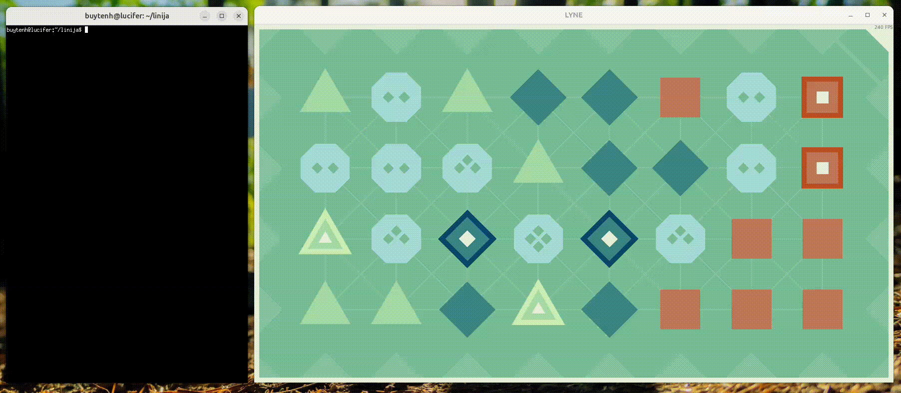

# linija: Hands-off autosolver for the LYNE puzzle game

[LYNE](https://www.lynegame.com/) is an awesome puzzle game that I found myself spending a lot of time playing, and I decided that it would be a worthwhile investment to automate the playing of this game so that I would be able get some of my time back.  This repository contains the program I wrote to do this.

### Example operation

This shows the autosolver solving LYNE level Z23:



The autosolver takes a screenshot of the LYNE window, enumerates the puzzle elements in the screenshot, computes a solution for the puzzle, and then injects the appropriate mouse movements and button events that will solve the puzzle, so that the game plays itself and the would-be player can instead focus on making GDP go up.

### Platform support

The autosolver currently only works on X Windows (X11), meaning that it won't work on Windows or macOS or Wayland-based systems.

On platforms where the autosolver is not supported, you can use the included PNG image solver instead.  For a screenshot of the puzzle above (LYNE's Z23), the image solver produces:

```
$ cargo run --bin solve_image Z23.png 
    Finished `dev` profile [unoptimized + debuginfo] target(s) in 0.02s
     Running `target/debug/solve_image Z23.png`
Solving Z23.png

t-2-t d d s 2 S       t 2 t d-d s 2 S       t 2 t d d s-2-S
| |\|                        \ \                       \|\ 
2-2-3-t d d 2 S       2 2 3 t d d 2 S       2 2 3 t d d 2 S
|\|   |                  / \ /  |                      / \ 
T 3 D 4 D 3 s s       T 3 D-4-D 3 s s       T 3 D 4 D 3-s s
 /|   |                  \ / \ /                      |\ \|
t-t d T d s s s       t t d T d s s s       t t d T d s-s s

(2, 0) (1, 0) (0, 0) (0, 1) (0, 2) (1, 2) (0, 1) (1, 1) (1, 0) (2, 1) (3, 0) (3, 1) (2, 1) (1, 1) (1, 2) (1, 3) (2, 3) (3, 3)
(2, 2) (2, 3) (1, 2) (2, 1) (3, 2) (2, 3) (1, 4) (0, 3) (0, 4) (1, 5) (2, 5) (3, 4) (2, 3) (2, 4)
(0, 7) (0, 6) (0, 5) (1, 6) (2, 5) (3, 5) (3, 6) (2, 5) (2, 6) (3, 7) (2, 7) (1, 6) (0, 6) (1, 7)

===

```

On top are ASCII art representations of the triangle path, the diamond path, and the square path, and below that are decompositions of those paths into sequences of grid points in `(row, column)` format.

### Details of operation

The core of the solver consists of a tile detection step, a grid alignment step, an edge finding and partitioning step, and finally, a trail tracing step.

The [tile detector](src/tile.rs) is very simple and naïve, and cheats by depending on LYNE only having a limited number of selectable color schemes, and by detecting the color scheme of the provided screenshot by looking at a border pixel, and then detecting tiles by looking for tile-specific colors in the screenshot.

(The initial version of the tile detector was much more sophisticated than this, and detected tiles by matching specific shapes in the image, and could work with any arbitrary color scheme and even with grayscale images, but it turned out that this was a lot more complicated than necessary in practice, and so, I switched to the current, simpler, and faster, version.)

Determining how the tiles in the puzzle should be interconnected [is done](src/edgemap/) by a recursive trial-and-error algorithm that solves a set of equations constraining the degrees and adjacent edge types for each of the tiles in the puzzle, obeying the following constraints:

* The degree of a triangle/diamond/square start tile must be 1, the degree of an intermediate triangle/diamond/square tile must be 2, and the degree of a connect-2/3/4 tile must be 4/6/8.
* Triangle/diamond/square tiles can only be adjacent to triangle/diamond/square edges.
* Connect-2/3/4 pieces can be adjacent to any edge types, but the number of adjacent edges of each type must be even.

Once a candidate edge partitioning has been found, the sets of edges are fed to the [trail tracer](src/trail.rs), which is an implementation of Hierholzer's trail tracing algorithm.  Note that a partitioning can still be rejected in this stage, as the edge partitioner does not necessarily produce connected sets of edges.  This is an example where the partitioner produces an invalid candidate partitioning, for which the set of triangle edges consists of more than one connected component:

```
S d D      S d-D      S d D
             |         \
D 3-t      D-3 t      D 3 t
    |        |         /
s 2 T      s 2 T      s-2 T
  |                      \
T-t S      T t S      T t S
```

If any set of edges turns out not to be connected, the trail tracer will fail to produce a trail and will reject the candidate edge partitioning.

### Testing

This solver has a testsuite, driven by the PNG solver, but said testsuite is not included in this repository due to concerns over whether distributing large numbers of game screenshots might be construed as infringement of game asset copyrights.

### Does using this program constitute cheating?

If I use this program to solve LYNE puzzles, it does not constitute cheating, since I wrote this program.

If you use this program to solve LYNE puzzles, it constitutes cheating, since you did not write this program.
